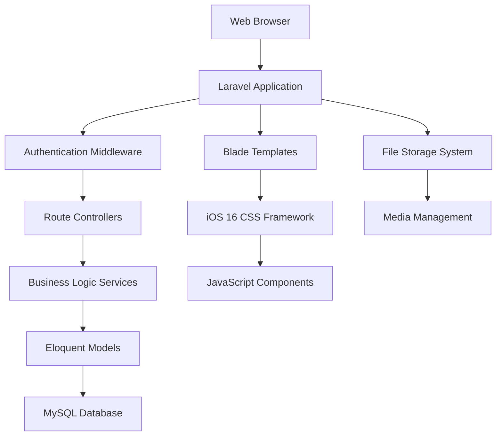
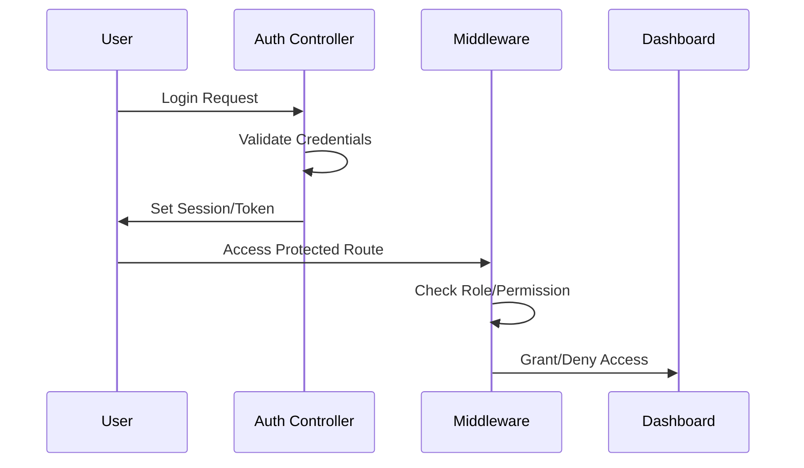

# Design Document

## Overview

The Laravel School Management System is a comprehensive web application built with Laravel 10+ and MySQL, featuring an iOS 16-inspired user interface. The system serves three primary user roles (admin, teacher, student) and provides both public-facing content and administrative functionality. The design emphasizes modern web standards, security, and responsive design principles that mirror iOS 16's visual language.

## Architecture

### System Architecture



### Technology Stack

- **Backend Framework**: Laravel 10+ (PHP 8.1+)
- **Database**: MySQL 8.0+
- **Frontend**: Blade Templates with iOS 16 CSS Framework
- **JavaScript**: Alpine.js for reactive components
- **CSS Framework**: Custom iOS 16-inspired design system
- **File Storage**: Laravel Storage with local/cloud drivers
- **Authentication**: Laravel Sanctum/Breeze
- **Image Processing**: Intervention Image

### Directory Structure

```
app/
├── Http/
│   ├── Controllers/
│   │   ├── Admin/
│   │   ├── Auth/
│   │   └── Public/
│   ├── Middleware/
│   └── Requests/
├── Models/
├── Services/
└── Providers/

resources/
├── views/
│   ├── admin/
│   ├── auth/
│   ├── public/
│   └── layouts/
├── css/
│   └── ios16/
└── js/

database/
├── migrations/
├── seeders/
└── factories/
```

## Components and Interfaces

### Authentication System

**Role-Based Access Control**
- Three primary roles: Admin, Teacher, Student
- Middleware-based route protection
- Permission-based feature access

**Authentication Flow**


### Core Modules

#### 1. Static Pages Module
- **Model**: `Page` (id, slug, title, content, banner_image, status, created_at, updated_at)
- **Controller**: `Admin\PageController` with full CRUD operations
- **Views**: Admin CRUD interface + public page display
- **Features**: Rich text editor, image upload, SEO-friendly URLs

#### 2. News & Events Module
- **Models**: 
  - `News` (id, title, content, category_id, featured_image, published_at, status)
  - `NewsCategory` (id, name, slug, description)
- **Controller**: `Admin\NewsController`, `Public\NewsController`
- **Features**: Category management, image galleries, publication scheduling

#### 3. Competency Programs Module
- **Model**: `Competency` (id, name, description, image, sort_order, status)
- **Controller**: `Admin\CompetencyController`, `Public\CompetencyController`
- **Features**: Program showcase, detailed descriptions, image management

#### 4. Gallery Module
- **Models**:
  - `GalleryAlbum` (id, name, description, cover_image, sort_order)
  - `GalleryItem` (id, album_id, title, image_path, type, sort_order)
- **Features**: Album organization, multiple media types, thumbnail generation

#### 5. PPDB (Student Registration) Module
- **Models**:
  - `PpdbRegistration` (id, registration_number, student_name, email, phone, documents, status, verified_at)
  - `PpdbSetting` (registration_period, requirements, status)
- **Features**: Online form, document upload, admin verification, status tracking

#### 6. User Management Module
- **Model**: `User` (extends Laravel's default with role, profile fields)
- **Features**: Role assignment, profile management, bulk operations

### iOS 16 Design System

#### Visual Components

**Card System**
```css
.ios-card {
    background: rgba(255, 255, 255, 0.8);
    backdrop-filter: blur(20px);
    border-radius: 16px;
    border: 1px solid rgba(255, 255, 255, 0.2);
    box-shadow: 0 8px 32px rgba(0, 0, 0, 0.1);
}
```

**Typography Hierarchy**
- Large Title: SF Pro Display, 34px, Bold
- Title 1: SF Pro Display, 28px, Regular
- Title 2: SF Pro Display, 22px, Regular
- Title 3: SF Pro Display, 20px, Semibold
- Headline: SF Pro Text, 17px, Semibold
- Body: SF Pro Text, 17px, Regular
- Caption: SF Pro Text, 12px, Regular

**Color Palette**
- Primary: #007AFF (iOS Blue)
- Secondary: #5856D6 (iOS Purple)
- Success: #34C759 (iOS Green)
- Warning: #FF9500 (iOS Orange)
- Danger: #FF3B30 (iOS Red)
- Background: #F2F2F7 (iOS Light Gray)

#### Navigation Patterns

**Desktop Navigation**
- Top navigation bar with school logo
- Sidebar navigation for admin areas
- Breadcrumb navigation for deep pages

**Mobile Navigation**
- Bottom tab bar (iOS style)
- Hamburger menu for secondary navigation
- Swipe gestures for gallery navigation

## Data Models

### Database Schema

```sql
-- Users table (extends Laravel default)
ALTER TABLE users ADD COLUMN role ENUM('admin', 'teacher', 'student') DEFAULT 'student';
ALTER TABLE users ADD COLUMN profile_image VARCHAR(255);
ALTER TABLE users ADD COLUMN phone VARCHAR(20);

-- Static Pages
CREATE TABLE pages (
    id BIGINT UNSIGNED AUTO_INCREMENT PRIMARY KEY,
    slug VARCHAR(255) UNIQUE NOT NULL,
    title VARCHAR(255) NOT NULL,
    content LONGTEXT,
    banner_image VARCHAR(255),
    meta_description TEXT,
    status ENUM('draft', 'published') DEFAULT 'draft',
    created_at TIMESTAMP NULL DEFAULT NULL,
    updated_at TIMESTAMP NULL DEFAULT NULL
);

-- News Categories
CREATE TABLE news_categories (
    id BIGINT UNSIGNED AUTO_INCREMENT PRIMARY KEY,
    name VARCHAR(255) NOT NULL,
    slug VARCHAR(255) UNIQUE NOT NULL,
    description TEXT,
    created_at TIMESTAMP NULL DEFAULT NULL,
    updated_at TIMESTAMP NULL DEFAULT NULL
);

-- News
CREATE TABLE news (
    id BIGINT UNSIGNED AUTO_INCREMENT PRIMARY KEY,
    title VARCHAR(255) NOT NULL,
    slug VARCHAR(255) UNIQUE NOT NULL,
    content LONGTEXT,
    excerpt TEXT,
    featured_image VARCHAR(255),
    category_id BIGINT UNSIGNED,
    author_id BIGINT UNSIGNED,
    published_at TIMESTAMP NULL,
    status ENUM('draft', 'published') DEFAULT 'draft',
    created_at TIMESTAMP NULL DEFAULT NULL,
    updated_at TIMESTAMP NULL DEFAULT NULL,
    FOREIGN KEY (category_id) REFERENCES news_categories(id) ON DELETE SET NULL,
    FOREIGN KEY (author_id) REFERENCES users(id) ON DELETE CASCADE
);

-- Competencies
CREATE TABLE competencies (
    id BIGINT UNSIGNED AUTO_INCREMENT PRIMARY KEY,
    name VARCHAR(255) NOT NULL,
    slug VARCHAR(255) UNIQUE NOT NULL,
    description LONGTEXT,
    image VARCHAR(255),
    sort_order INT DEFAULT 0,
    status ENUM('active', 'inactive') DEFAULT 'active',
    created_at TIMESTAMP NULL DEFAULT NULL,
    updated_at TIMESTAMP NULL DEFAULT NULL
);

-- Gallery Albums
CREATE TABLE gallery_albums (
    id BIGINT UNSIGNED AUTO_INCREMENT PRIMARY KEY,
    name VARCHAR(255) NOT NULL,
    slug VARCHAR(255) UNIQUE NOT NULL,
    description TEXT,
    cover_image VARCHAR(255),
    sort_order INT DEFAULT 0,
    created_at TIMESTAMP NULL DEFAULT NULL,
    updated_at TIMESTAMP NULL DEFAULT NULL
);

-- Gallery Items
CREATE TABLE gallery_items (
    id BIGINT UNSIGNED AUTO_INCREMENT PRIMARY KEY,
    album_id BIGINT UNSIGNED NOT NULL,
    title VARCHAR(255),
    image_path VARCHAR(255) NOT NULL,
    type ENUM('image', 'video') DEFAULT 'image',
    sort_order INT DEFAULT 0,
    created_at TIMESTAMP NULL DEFAULT NULL,
    updated_at TIMESTAMP NULL DEFAULT NULL,
    FOREIGN KEY (album_id) REFERENCES gallery_albums(id) ON DELETE CASCADE
);

-- PPDB Registrations
CREATE TABLE ppdb_registrations (
    id BIGINT UNSIGNED AUTO_INCREMENT PRIMARY KEY,
    registration_number VARCHAR(50) UNIQUE NOT NULL,
    student_name VARCHAR(255) NOT NULL,
    email VARCHAR(255) NOT NULL,
    phone VARCHAR(20) NOT NULL,
    birth_date DATE NOT NULL,
    address TEXT NOT NULL,
    parent_name VARCHAR(255) NOT NULL,
    parent_phone VARCHAR(20) NOT NULL,
    documents JSON,
    status ENUM('pending', 'verified', 'rejected') DEFAULT 'pending',
    verified_at TIMESTAMP NULL,
    verified_by BIGINT UNSIGNED NULL,
    notes TEXT,
    created_at TIMESTAMP NULL DEFAULT NULL,
    updated_at TIMESTAMP NULL DEFAULT NULL,
    FOREIGN KEY (verified_by) REFERENCES users(id) ON DELETE SET NULL
);

-- PPDB Settings
CREATE TABLE ppdb_settings (
    id BIGINT UNSIGNED AUTO_INCREMENT PRIMARY KEY,
    registration_start DATE NOT NULL,
    registration_end DATE NOT NULL,
    requirements JSON,
    status ENUM('active', 'inactive') DEFAULT 'inactive',
    created_at TIMESTAMP NULL DEFAULT NULL,
    updated_at TIMESTAMP NULL DEFAULT NULL
);
```

### Model Relationships

```php
// User Model
class User extends Authenticatable
{
    public function news() { return $this->hasMany(News::class, 'author_id'); }
    public function verifiedRegistrations() { return $this->hasMany(PpdbRegistration::class, 'verified_by'); }
}

// News Model
class News extends Model
{
    public function category() { return $this->belongsTo(NewsCategory::class); }
    public function author() { return $this->belongsTo(User::class, 'author_id'); }
}

// Gallery Models
class GalleryAlbum extends Model
{
    public function items() { return $this->hasMany(GalleryItem::class, 'album_id'); }
}
```

## Error Handling

### Exception Handling Strategy

1. **Global Exception Handler**: Custom handler for consistent error responses
2. **Validation Errors**: Form request classes with custom error messages
3. **404 Handling**: Custom 404 pages with iOS 16 styling
4. **Server Errors**: Graceful degradation with user-friendly messages
5. **File Upload Errors**: Specific handling for media upload failures

### Logging Strategy

```php
// Custom logging channels
'channels' => [
    'auth' => [
        'driver' => 'single',
        'path' => storage_path('logs/auth.log'),
    ],
    'ppdb' => [
        'driver' => 'single',
        'path' => storage_path('logs/ppdb.log'),
    ],
    'media' => [
        'driver' => 'single',
        'path' => storage_path('logs/media.log'),
    ],
]
```

## Testing Strategy

### Testing Pyramid

1. **Unit Tests**: Model methods, service classes, utilities
2. **Feature Tests**: HTTP endpoints, authentication flows
3. **Browser Tests**: Critical user journeys using Laravel Dusk
4. **Integration Tests**: Database interactions, file uploads

### Key Test Scenarios

- Authentication and authorization flows
- CRUD operations for all modules
- File upload and media processing
- PPDB registration and verification process
- Responsive design across devices
- Performance under load

### Test Data Management

- Database factories for all models
- Seeders for consistent test environments
- Image fixtures for media testing
- Mock external services where applicable

## Security Considerations

### Input Validation & Sanitization

- Form Request classes for all user inputs
- HTML purification for rich text content
- File type validation for uploads
- SQL injection prevention through Eloquent ORM

### Authentication & Authorization

- Laravel Sanctum for API authentication
- Role-based middleware for route protection
- CSRF protection on all forms
- Session security configuration

### File Upload Security

- Whitelist allowed file types
- Virus scanning for uploaded files
- Secure file storage outside web root
- Image optimization and resizing

### Data Protection

- Encryption for sensitive data
- Secure password hashing
- GDPR compliance considerations
- Audit logging for sensitive operations

This design provides a solid foundation for building a modern, secure, and user-friendly school management system with iOS 16 aesthetics and Laravel best practices.